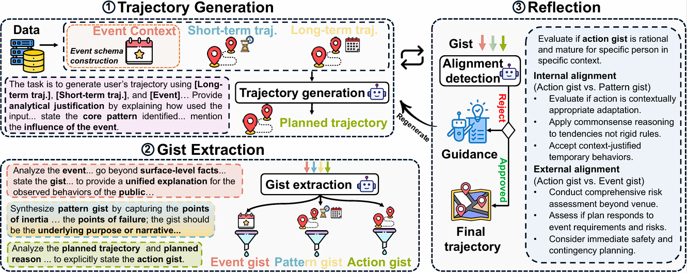

# ELLMob
This is the official implementation for the paper "[ICLR'26] ELLMob: Event-Driven Human Mobility Generation with Self-Aligned LLM Framework".

# Structure of ELLMob


# Dataset
Update soon.

## Citation
If this repository is useful for you, please cite as:
```
@inproceedings{
wang2026ellmob,
title={{ELLM}ob: Event-Driven Human Mobility Generation with Self-Aligned {LLM} Framework},
author={Yusong Wang and Chuang Yang and Jiawei Wang and Xiaohang Xu and Jiayi Xu and Dongyuan Li and Chuan Xiao and Renhe Jiang},
booktitle={The Fourteenth International Conference on Learning Representations},
year={2026},
}

```
