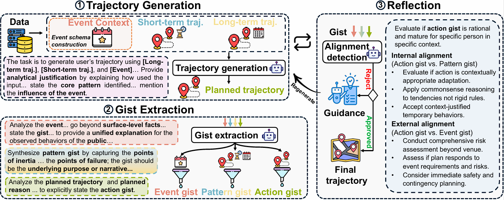

# ELLMob
This is the official implementation for the paper "[ICLR'26] ELLMob: Event-Driven Human Mobility Generation with Self-Aligned LLM Framework".

# Structure of ELLMob


# Dataset
You can use the raw data for your own research, and you can also use the preprocessed files to continue research on event-driven human mobility.

```
python preprocess.py
```

# Event
In traj_generator.py to switch event type:

event_context = "Put event context here."


# Inference

```
python run.py
```

# evaluation

```
python evaluation.py
```

## Citation
If this repository is useful for you, please cite as:
```

```
